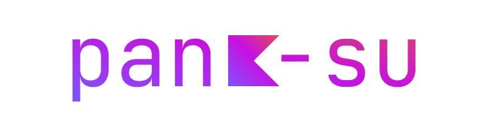

```kotlin
val `pank-su` = developer{
    about{
      name = "Pankov Vasya"
      lang = Language.ru
    }
    skills {
        item {
            name = "Kotlin"
            others = listOf("Cross-Platform Development", "UI/UX Design", "Lib Development", "Compose MONSTER", "Clean Arch")
        }
        item{
            name = "Git"
            others = listOf("clone", "commit", "push", "pull", "merge", "switch", "branch", "checkout", "cherry-pick 🍒")
        }
        item{
            name = "Docker"
            others = listOf("build", "run", "dev workspace", "compose")
        }
        item{
            name = "CI/CD"
            others = listOf("Github", "Gitlab", "Kotlin", "Typst")
        }
        item{
            name = "Typst" // Just for SUAI docs
        }
    }
    
    works{
        work{
          name = "Valdai Robots"
          duration = 6.months
          whatIDo = "Design of a mobile robot control system and development of a user interface for the same system"
        }
    }
}
```
